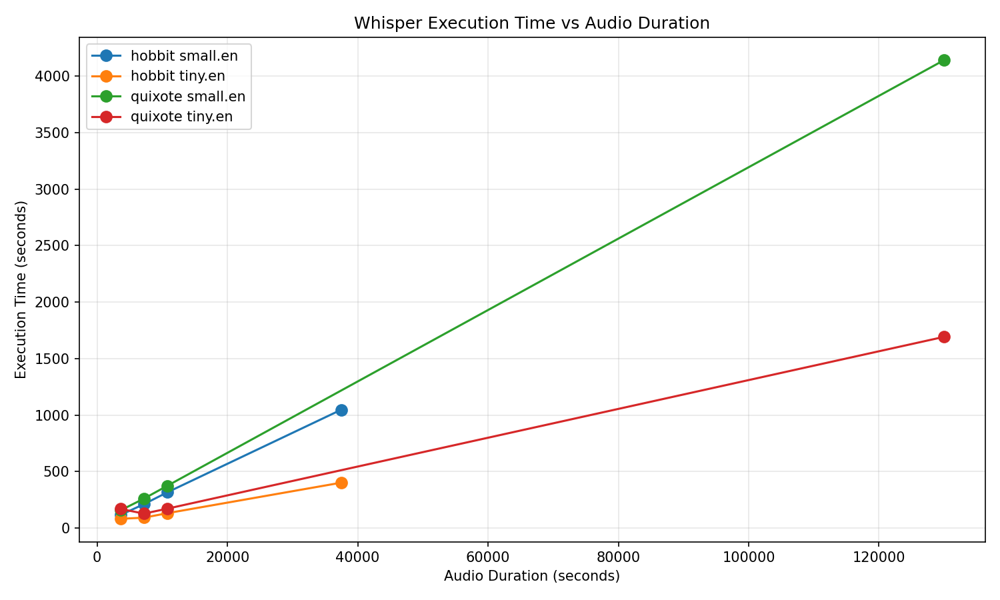
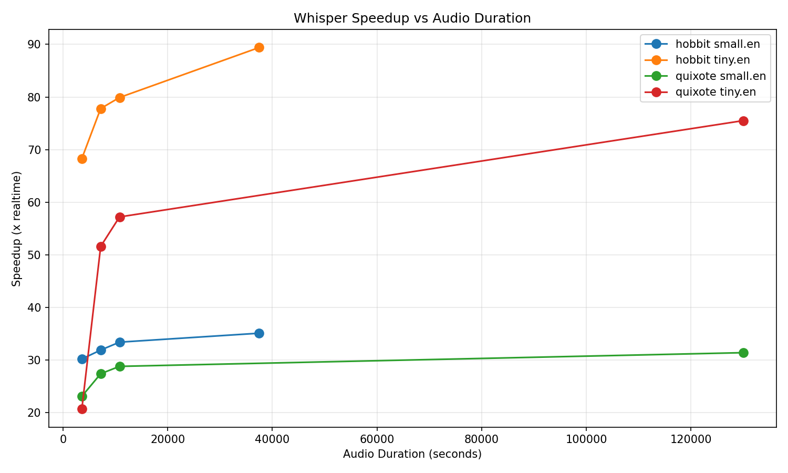

# Whisper Benchmark Results

Generated: 2026-01-26T01:57:02.011Z

## Results

| Input       | Model    | Duration | Elapsed | Speedup | Timestamp                |
| ----------- | -------- | -------- | ------- | ------- | ------------------------ |
| hobbit.m4b  | small.en | full     | 1016s   | 36.9x   | 2026-01-25T12:53:55.390Z |
| hobbit.m4b  | small.en | 3600s    | 115s    | 31.3x   | 2026-01-25T12:15:54.985Z |
| hobbit.m4b  | small.en | 7200s    | 222s    | 32.4x   | 2026-01-25T12:19:37.460Z |
| hobbit.m4b  | small.en | 10800s   | 322s    | 33.5x   | 2026-01-25T12:24:59.386Z |
| hobbit.m4b  | tiny.en  | full     | 407s    | 92.0x   | 2026-01-25T12:36:59.873Z |
| hobbit.m4b  | tiny.en  | 3600s    | 51s     | 70.6x   | 2026-01-25T21:25:00.706Z |
| hobbit.m4b  | tiny.en  | 7200s    | 92s     | 78.5x   | 2026-01-25T21:26:32.484Z |
| hobbit.m4b  | tiny.en  | 10800s   | 138s    | 78.4x   | 2026-01-25T12:13:59.854Z |
| quixote.m4b | small.en | full     | 4157s   | 31.3x   | 2026-01-26T01:57:02.000Z |
| quixote.m4b | small.en | 3600s    | 155s    | 23.2x   | 2026-01-26T00:37:10.626Z |
| quixote.m4b | small.en | 7200s    | 264s    | 27.3x   | 2026-01-26T00:41:34.230Z |
| quixote.m4b | small.en | 10800s   | 371s    | 29.1x   | 2026-01-26T00:47:44.872Z |
| quixote.m4b | tiny.en  | full     | 1712s   | 75.9x   | 2026-01-26T00:34:35.512Z |
| quixote.m4b | tiny.en  | 3600s    | 91s     | 39.4x   | 2026-01-26T00:00:56.062Z |
| quixote.m4b | tiny.en  | 7200s    | 131s    | 55.0x   | 2026-01-26T00:03:06.930Z |
| quixote.m4b | tiny.en  | 10800s   | 176s    | 61.3x   | 2026-01-26T00:06:03.121Z |

## Plots (side-by-side)

<!-- markdownlint-disable MD033 -->
<table><tr>
<td></td>
<td></td>
</tr></table>

## Execution Time

## Speedup

