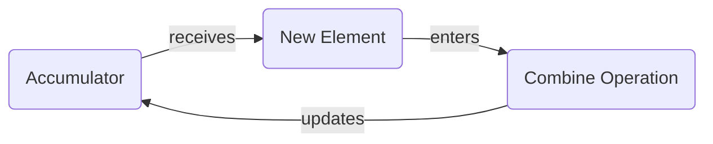

### TinkeReReader

#### AI-Leveraged Book Exploration

// @daneroo

`\[
\text{AI Tinkerers Ottawa}_{\text{Hackathon}}^{\text{2023}}
\]`

---

> "Every Tinkerer needs a workbench"

---

## Assumptions and Choices

- Locally running LLM's
  - Ollama / GPT4All / LM Studio
- Programming Frameworks
  - LangChain (.js)
  - LlamaIndex
- Topic of Inquiry
  - Books; ebooks in particular
  - Sample Documents

---

## Questions one might ask

These are not well suited for RAG

- Summary (at different levels)
- List of characters / locations

---

## Basics

- Basic Q&A
- RAG
- Summarization

---

## Map / Reduce

- Summarization Chain
  - Refine is unstable

---

<!-- .slide: data-background="#dddddd" -->

### Map / Reduce (ctd)

---

## Math Reduce

`\[
\text{length}_\text{tot} = \sum_{\text{doc} \in \text{docs}} \text{length}(\text{doc})
\]`

---

## MathJax

A thin wrapper for MathJax

`\[P(E) = {n \choose k} p^k (1-p)^{ n-k} \]`

`\[ \frac{1}{\Bigl(\sqrt{\phi \sqrt{5}}-\phi\Bigr) e^{\frac25 \pi}} = 1+\frac{e^{-2\pi}} {1+\frac{e^{-4\pi}} {1+\frac{e^{-6\pi}} {1+\frac{e^{-8\pi}} {1+\ldots} } } } \]`

---

## The End

---
