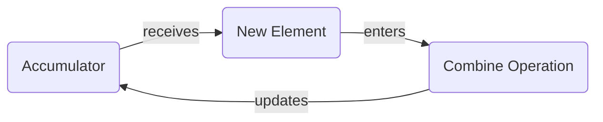

### TinkeReReader

#### Book Exploration with LLM's


// @daneroo

---

### Summary

We _"Tinkered"_ with long-form text.
Attempting to answer questions that are not well suited for simple RAGs.

- First with summarization
- Second with character extraction
  - from Novels / Thesis / Blog

--

### Links

- [This Slide Deck](https://slides.ai-garden.v.imetrical.com/)
- [The Code](https://github.com/daneroo/ai-garden/tree/main/langchain-js-local-ollama)
- Sample Results
  - [Summarization - Hero Of Ages - LLama2](https://github.com/daneroo/ai-garden/blob/main/langchain-js-local-ollama/results/map-reduce-summary-llama2-hero.2023-11-23T20%3A40%3A19Z.md#level-3-summary)
  - [Summarization - Hero Of Ages - Mistral](https://github.com/daneroo/ai-garden/blob/main/langchain-js-local-ollama/results/map-reduce-summary-mistral-hero.2023-11-23T20%3A42%3A30Z.md#level-2-summary)
  - [Character Extraction - Hero Of Ages - LLama2](https://github.com/daneroo/ai-garden/blob/main/langchain-js-local-ollama/results/map-reduce-characters-llama2-hero.2023-11-26T06%3A03%3A11Z.md#level-2-character-summaries)
  - [Character Extraction - Hero Of Ages - Mistral](https://github.com/daneroo/ai-garden/blob/main/langchain-js-local-ollama/results/map-reduce-characters-mistral-hero.2023-11-26T06%3A01%3A11Z.md#elend-75-mentions---level-2-character-summary)
- Asciinema recordings
  - [Character Extraction (Neon / Mistral)](https://asciinema.org/a/FCyk9wohJVb6GAcFjqGSgKv9e)
  - [Character Extraction (Neon / LLama2)](https://asciinema.org/a/39KrddgNY2nkWJz2upwsh5lku)

--

### Asciinema - Character Extraction (Neon / Mistral)

[](https://asciinema.org/a/FCyk9wohJVb6GAcFjqGSgKv9e)

--

### Asciinema - Character Extraction (Neon / LLama2)

[](https://asciinema.org/a/39KrddgNY2nkWJz2upwsh5lku)

Why do you think this would be a good talk for this audience?

It relates to direct, "hands-on" experimentation and development.
Using LangChain(.js) and Local LLMs (llama2/mistral) to perform Map/Reduce operations on long-form text.

---

> "Every Tinkerer needs a workbench"

<!-- image -->


#### Experiments →

#### Tools and Setup ↓

--

### Initial Setup and Trials

- LLM's
  - OpenAI's API
  - LM Studio
  - GPT4All
- python3, LangChain(.py)
  - pipenv, virtualenv, poetry,...
  - LlamaIndex
- node.js, LangChain(.js)
  - pnpm, nx

--

### Hello worlds

> "Every Tinkerer needs a workbench"

- LagChain Basics
  - Document Loaders
  - Tokenization
  - Chat Chain
  - Simple Rag (HNSWLib)

--

### Move to LangChain(.js)

- Familiarity
  - _especial dependency management_
- Better monorepo management
  - pnpm / nx

--

### Exploring LangChain(.js)

- Callbacks (ConsoleCallbackHandler)
- Caching
- Extract my own common patterns
  - Sources
  - Templating

---

### Choice of Weapons

- Locally running LLM's
  - Ollama (llama2 7b / mistral 7b)
- LangChain (.js)
- Sources
  - Choice ePub ebooks
  - Thesis
  - Synthesized text (Thanks GTP4)

---

### Summarization - 1st attempt

Using LangChain(.js)

```js
const chain = loadSummarizationChain(model, { type: "refine" });
```

```txt
summary = summarize(chunk1)
summary = summarize(chunk2, summary)
summary = summarize(chunk3, summary)
...
```

When this is performed on a large number of chunks (>30), the _running_ summary becomes very forgetful.

---

### Summarization - 2nd attempt

Repeatedly `split`, `summarize`, `concat`

```js
level0Chunks = split(OriginalText)
level0Summaries = [...level0Chunks].map(summarize)
level1Txt = concat(level0Summaries)

level1Chunks = split(level1Txt)
level1Summaries = [level1Chunks].map(summarize)
level2Txt = concat(level1Summaries)

...
```

Until `levelNText` is small enough.

This turns out to be a very effective approach, and produces a very good summary.

---

### Example Result

<a href="https://github.com/daneroo/ai-garden/blob/main/langchain-js-local-ollama/results/map-reduce-summary-mistral-hero.2023-11-23T20%3A42%3A30Z.md#level-2-summary" target="_blank">Hero of Ages - Summary ↗️</a>

`~10:1` reduction per level

| Level    | Documents | Size (kB) |
| -------- | --------- | --------- |
| Original | 89        | 1336.85   |
| Level 0  | 213       | 179.04    |
| Level 1  | 23        | 16.70     |
| Level 2  | 3         | 1.96      |

---

### Character Extraction - 1

- extract the characters from a novel
- aggregate their descriptions

Same as with summarization

- langChain's `refine` is not suited for long text.
- The refine chain is too lossy, or _forgetful_

---

### Character Extraction - 2.1

- Extract characters from each chunk (LLM)
  - Constrain to JSON (with a schema)

```json
chunk1:[
  { "name": "Dr. Yamada", "description": "A scientist" },
  { "name": "Kaito", "description": "A hacker" }
]

chunk2:[
  { "name": "Kaito", "description": "invaluable to Dr. Yamada" }
]
...chunkN:
```

Then ...

---

### Character Extraction - 2.2

- Aggregate the descriptions (JavaScript)
- Synthesize a description (LLM)

```json
{
  "Kaito": ["A hacker", "invaluable to Dr. Yamada"],
  "Dr. Yamada": ["A scientist"]
}
```

> "Kaito is a hacker, invaluable to Dr. Yamada"

---

### Character Extraction - Example

<a href="https://github.com/daneroo/ai-garden/blob/main/langchain-js-local-ollama/results/map-reduce-characters-mistral-neon.2023-11-26T09%3A03%3A55Z.md#level-2-character-summaries" target="_blank">Neon - Characters - llama2 ↗️</a>

- Kaito
  - A young street-smart hacker with a ...
  - He joins the trio stop The Architect ...

#### Reformulated

Kaito is a young street-smart individual with a reputation within the underground networks, ... Kaito joins the trio on their quest to stop The Architect.

---

<a href="https://github.com/daneroo/ai-garden/blob/main/langchain-js-local-ollama/results/map-reduce-characters-llama2-hero.2023-11-26T06%3A03%3A11Z.md#level-2-character-summaries" target="_blank">Hero Of Ages - Characters - llama2 ↗️</a>

| Character | Mentioned in |
| --------: | ------------ |
|       Vin | 77           |
|     Elend | 55           |
|     Sazed | 47           |
|     Spook | 33           |
|      Ruin | 30           |
|    Breeze | 30           |
|   Kelsier | 23           |

---

### Future Work

- Lot's of refactoring **;-)**
- JSON OutputParser can be made more robust
- Disk caching (refinements)
- Extend to other aspects of long-form text
  - Locations
  - Events
- Combine with RAGs
  - By indexing the summaries and aggregations

---

### Takeaways

- A concrete project is invaluable to learning LLM's
- LangChain(.js) is a great tool to start
- Local LLM's are truly a feasible option
- Map/Reduce is a powerful pattern

---

### Thank You

// @daneroo

`\[
\text{Daniel Lauzon} = \sum_{meetups} \text{people}_{met} + \epsilon
\]`

---

## The End.


---

<!-- .slide: data-background="#dddddd" -->

### Map / Reduce (ctd)



---

## Math Reduce

`\[
\text{length}_\text{tot} = \sum_{\text{doc} \in \text{docs}} \text{length}(\text{doc})
\]`

---

## MathJax

A thin wrapper for MathJax

`\[P(E) = {n \choose k} p^k (1-p)^{ n-k} \]`

`\[ \frac{1}{\Bigl(\sqrt{\phi \sqrt{5}}-\phi\Bigr) e^{\frac25 \pi}} = 1+\frac{e^{-2\pi}} {1+\frac{e^{-4\pi}} {1+\frac{e^{-6\pi}} {1+\frac{e^{-8\pi}} {1+\ldots} } } } \]`

`\[
{}_{\text{Ottawa}}^{\,\quad\text{AI}} \text{Tinkerer}_{\text{Hackathon}}^{2023}
\]`

---
