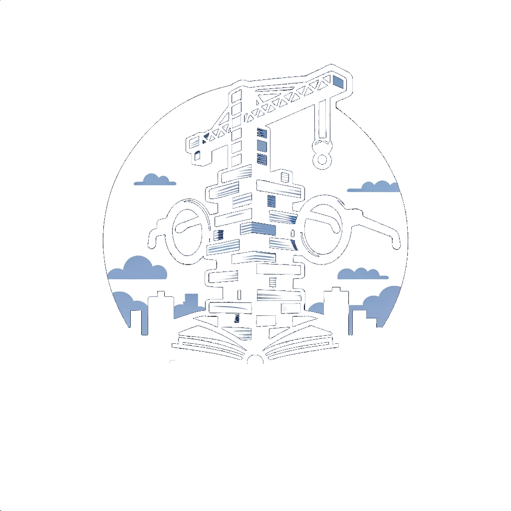

### TinkeReReader

#### Book Exploration with LLM's

// @daneroo

---

### Summary

We "Tinkered" with long-form text.
Attempting to answer questions that are not well suited for simple RAGs.

- First with summarization
- Second with character extraction and description from a Novel

--

### Links

- [This Slide Deck](https://slides.ai-garden.v.imetrical.com/)
- [The Code](https://github.com/daneroo/ai-garden/tree/main/langchain-js-local-ollama)
- Sample Results
  - [Summarization - Hero Of Ages - LLama2](https://github.com/daneroo/ai-garden/blob/main/langchain-js-local-ollama/results/map-reduce-summary-llama2-hero.2023-11-23T20%3A40%3A19Z.md#level-3-summary)
  - [Summarization - Hero Of Ages - Mistral](https://github.com/daneroo/ai-garden/blob/main/langchain-js-local-ollama/results/map-reduce-summary-mistral-hero.2023-11-23T20%3A42%3A30Z.md#level-2-summary)
  - [Character Extraction - Hero Of Ages - LLama2](https://github.com/daneroo/ai-garden/blob/main/langchain-js-local-ollama/results/map-reduce-characters-llama2-hero.2023-11-26T06%3A03%3A11Z.md#level-2-character-summaries)
  - [Character Extraction - Hero Of Ages - Mistral](https://github.com/daneroo/ai-garden/blob/main/langchain-js-local-ollama/results/map-reduce-characters-mistral-hero.2023-11-26T06%3A01%3A11Z.md#elend-75-mentions---level-2-character-summary)
- Asciinema recordings
  - [Character Extraction (Neon / Mistral)](https://asciinema.org/a/FCyk9wohJVb6GAcFjqGSgKv9e)
  - [Character Extraction (Neon / LLama2)](https://asciinema.org/a/39KrddgNY2nkWJz2upwsh5lku)

--

### Asciinema - Character Extraction (Neon / Mistral)

--

### Asciinema - Character Extraction (Neon / LLama2)

Why do you think this would be a good talk for this audience?

It relates to direct, "hands-on" experimentation and development.
Using LangChain(.js) and Local LLMs (llama2/mistral) to perform Map/Reduce operations on long-form text.

---

> "Every Tinkerer needs a workbench"

<!-- image -->

---

## Assumptions and Choices

- Locally running LLM's
  - Ollama / GPT4All / LM Studio
- Programming Frameworks
  - LangChain (.js)
  - LlamaIndex
- Topic of Inquiry
  - Books; ebooks in particular
  - Sample Documents

---

## Questions one might ask

These are not well suited for RAG

- Summary (at different levels)
- List of characters / locations

---

## Basics

- Basic Q&A
- RAG
- Summarization

---

## Map / Reduce

- Summarization Chain
  - Refine is unstable

---

<!-- .slide: data-background="#dddddd" -->

### Map / Reduce (ctd)

---

## Math Reduce

`\[
\text{length}_\text{tot} = \sum_{\text{doc} \in \text{docs}} \text{length}(\text{doc})
\]`

---

## MathJax

A thin wrapper for MathJax

`\[P(E) = {n \choose k} p^k (1-p)^{ n-k} \]`

`\[ \frac{1}{\Bigl(\sqrt{\phi \sqrt{5}}-\phi\Bigr) e^{\frac25 \pi}} = 1+\frac{e^{-2\pi}} {1+\frac{e^{-4\pi}} {1+\frac{e^{-6\pi}} {1+\frac{e^{-8\pi}} {1+\ldots} } } } \]`

`\[
{}_{\text{Ottawa}}^{\,\quad\text{AI}} \text{Tinkerer}_{\text{Hackathon}}^{2023}
\]`

---

## The End

---
