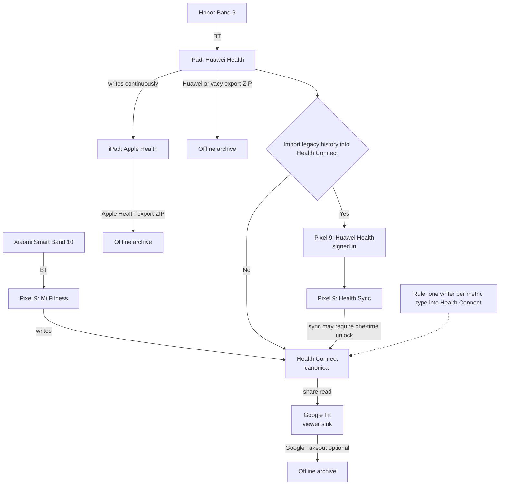
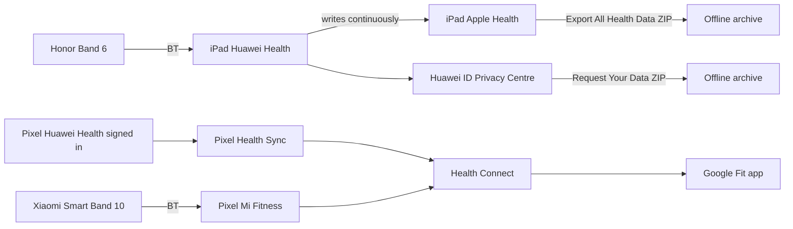

# Smart Band migration research

This file holds background, definitions, and findings that support
`smart-band/PLAN.md`.

Guideline: prefer short, testable statements. If a finding changes what you do,
also update `smart-band/PLAN.md` (keep the plan readable).

## Context and constraints

- Current device: Honor Band 6 (app: Huawei Health).
- Current collector: iPad running Huawei Health with historical data.
- Confirmed: Huawei Health on iPad writes into Apple Health continuously.
- Target: Xiaomi Smart Band 10 on Pixel 9.
- Constraints:
  - No subscriptions to access your own data.
  - Data stays open/accessible (exportable).
  - Avoid cloud lock-in when possible.

## Terminology (used in the plan)

- Canonical: the primary store of truth (you trust it for continuity + export).
- Sink/viewer: a destination you keep for convenience/compatibility (not truth).
- Writer: an app that writes a metric into Health Connect.
- Metric type: steps, sleep, HR, workouts, etc.
- Duplicate risk: two writers writing the same metric type into the same store.

## Glossary

### Huawei Health

- Current collector/app for Honor Band 6.
- In this setup it runs on iPad and contains your historical data.
- It also writes to Apple Health continuously.

### Apple Health (iPad)

- Receives Huawei Health data continuously.
- Provides a built-in export (offline ZIP) that you own.

### Health Connect

- Android on-device health data broker.
- Preferred canonical hub on Pixel.
- Supports backup/export (your escape hatch).

### Google Fit

- A Google health data store/app ecosystem.
- Treat as sink/viewer (Google Fit APIs deprecating in 2026).
- Export via Google Takeout.
- If you enable Health Connect integration in Fit, prefer Fit reading shared data
  from Health Connect vs writing parallel data into Fit.

### Health Sync (appyhapps)

- Third-party bridge app that can sync across sources/destinations.
- May require a one-time payment for historical sync.
- Can be used with Health Connect as a destination.

### Mi Fitness

- Xiaomi companion app (collector for Smart Band 10 on Pixel).

### Gadgetbridge

- FOSS wearable companion.
- For newer Xiaomi devices, support can be firmware-dependent (protobuf caveats).

## System overview

### Unified graph (data + decisions)

If your viewer supports Mermaid, use the graph below. If not, the ASCII graph
under it is the fallback.

### Combined dataflow graph (legacy + migration + future)

Notes

- Prefer Health Connect as canonical.
- Prefer Fit as a viewer/sink.
- Avoid duplicate writers per metric type.

## Legacy history options (Honor Band 6)

You can choose one of these approaches:

1. Clean break: leave history in Huawei Health; start fresh.
2. Import into Health Connect: requires Huawei Health on Pixel (history visible)
   + Health Sync bridging to Health Connect.
3. Offline archive: Huawei Privacy Centre ZIP and/or Apple Health export ZIP.

## Ongoing data options (Smart Band 10)

Default target:

- Band 10 -> Mi Fitness -> Health Connect -> (optional) Google Fit viewer

If Mi Fitness misses a metric:

- Use a bridge (e.g., Health Sync) only if it preserves one-writer-per-metric.

## Home Assistant notes

- Treat HA integration as optional; avoid making it part of the first stable path.
- If you later go local-first (Gadgetbridge), expect more work (bridge/ETL).

## Findings

- (none yet)
