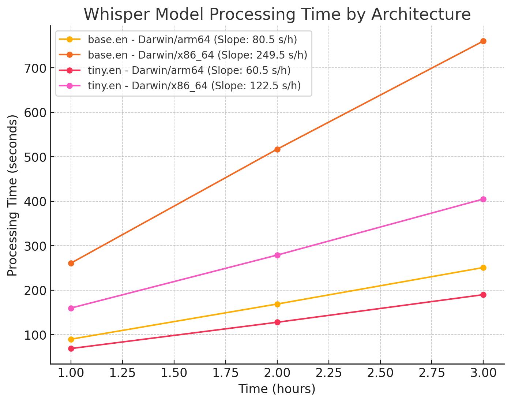

# Whisper.cpp invocation

This is just a coordination script.
We keep the [whisper.cpp](https://github.com/ggerganov/whisper.cpp/tree/master) in `external-repos`

As of 2023-09-16 I can;t get bindings/go to work on the mac mini,
so I have reverted to using the `main` binary.

We want to:

- process `.m4b` files directly
- process wav
- produce SRT/VTT/JSON

## TODO

- home brew - get inspiration from nix pkg: <https://github.com/NixOS/nixpkgs/blob/nixos-24.05/pkgs/tools/audio/openai-whisper-cpp/default.nix#L115>
  - GGML_METAL_PATH_RESOURCES = ...
- fix whisper.sh to to single part files again
- [ ] make a standard benchmark
  - [ ] run bench on galois
  - [ ] run bench on feynman
- [ ] use `-ot XXms` to offset output vtt
- [ ] cleanup the scripts (prompts and validation)
- [ ] run in docker/nix/brew

## piping/splitting with ffmpeg to whisper

So, the maximum duration of a WAV file that can be created under the 4 GiB limit, given your audio settings, is approximately 37 hours, 16 minutes, and 57.728 seconds.

We can split the wav files into segments, but alignment seems to be a problem.

```bash
for i in split/*wav; do echo $i $(ffprobe -v error -show_entries format=duration -of default=noprint_wrappers=1:nokey=1 "$i") ; done
for i in ~/Downloads/WhisperCPPContent/*wav; do echo $i $(ffprobe -v error -show_entries format=duration -of default=noprint_wrappers=1:nokey=1 "$i") ; done
```

## Nix - openai-whisper-cpp

```bash
nix-shell -p openai-whisper-cpp

# download models
mkdir models
(cd models; whisper-cpp-download-ggml-model tiny.en)
(cd models; whisper-cpp-download-ggml-model base.en)

whisper-cpp -m ./models/ggml-tiny.en.bin -d 360000 "/Users/daniel/Downloads/WhisperCPPContent/J.R.R. Tolkien - The Hobbit - Andy Serkis.wav"
```

## Homebrew - whisper-cpp

Using brew's `brew install whisper-cpp` is working at about half speed, METAL is not loading properly.

```txt
ggml_metal_init: loading 'ggml-metal.metal'
ggml_metal_init: error: Error Domain=MTLLibraryErrorDomain Code=3 "program_source:3:10: fatal error: 'ggml-common.h' file not found
#include "ggml-common.h"
```

## Operation

We created the `whisper.sh` script to coordinate the invocation of the `main` binary,
as well as attendant ffmpeg commands to produce intermediate `.wav` files.

We invoke our script with the root path to the `.m4b` files we want to transcribe.
From there the .wav files are created and transcribed.

CoreML didn't change performance, so just using metal.

```bash
 ❯ ./whisper.sh -h
Usage: ./whisper.sh -i base directory [-d duration] [-m model] [-o output]
Parameters:
  -i  Base directory (required, no default)
  -d  Duration (default: None, meaning entire file duration)
  -m  Model (default: base.en)
  -o  Output (default: /Users/daniel/Downloads/WhisperCPPContent)

./whisper.sh -i /Volumes/Reading/audiobooks/Joe\ Abercrombie\ -\ The\ First\ Law/Joe\ Abercrombie\ -\ The\ First\ Law\ 01\ -\ The\ Blade\ Itself

./whisper.sh -i /Volumes/Reading/audiobooks/John\ Gwynne\ -\ Faithful\ and\ the\ Fallen/John\ Gwynne\ -\ Faithful\ and\ the\ Fallen\ 03\ -\ Ruin/

./whisper.sh -i /Volumes/Reading/audiobooks/John\ Gwynne\ -\ Faithful\ and\ the\ Fallen/John\ Gwynne\ -\ Faithful\ and\ the\ Fallen\ 04\ -\ Wrath/
# force tiny.en model, default is base.en
./whisper.sh -m tiny.en -i /Volumes/Reading/audiobooks/John\ Gwynne\ -\ Faithful\ and\ the\ Fallen/John\ Gwynne\ -\ Faithful\ and\ the\ Fallen\ 04\ -\ Wrath/

 ./whisper.sh -i /Volumes/Reading/audiobooks/Iain\ M.\ Banks\ -\ Culture\ Novels/Iain\ M.\ Banks\ -\ Culture\ 03\ -\ Use\ Of\ Weapons/
 ./whisper.sh -m tiny.en -i /Volumes/Reading/audiobooks/Iain\ M.\ Banks\ -\ Culture\ Novels/Iain\ M.\ Banks\ -\ Culture\ 03\ -\ Use\ Of\ Weapons/

 ./whisper.sh -i /Volumes/Reading/audiobooks/Stephen\ Kotkin\ -\ Stalin/Stephen\ Kotkin\ -\ Stalin\ 01\ -\ Paradoxes\ of\ Power/
 ./whisper.sh -m tiny.en -i /Volumes/Reading/audiobooks/Stephen\ Kotkin\ -\ Stalin/Stephen\ Kotkin\ -\ Stalin\ 01\ -\ Paradoxes\ of\ Power/
```

## Setup (whisper.cpp)

See Nix pkg: <https://github.com/NixOS/nixpkgs/blob/nixos-23.11/pkgs/tools/audio/openai-whisper-cpp/default.nix#L57>

The brew formula has problems using METAL/GPU.

### Whisper.cpp clone and/or update

The upstream repo [whisper.cpp](https://github.com/ggerganov/whisper.cpp/tree/master) in `external-repos`

We might want to periodically update the repo and models.

```bash
# clone the repo
cd external-repos/
git clone git@github.com:ggerganov/whisper.cpp.git
cd whisper.cpp

# update the repo
git pull
```

### Get some models

The models are stored in `external-repos/whisper.cpp/models/`.

```bash
# get some models (.en) tiny.en base.en small.en medium.en (no large.en)
# get some more models (all langs) tiny base small medium large-v1 large

bash ./models/download-ggml-model.sh tiny.en
bash ./models/download-ggml-model.sh base.en
# bash ./models/download-ggml-model.sh small.en
# bash ./models/download-ggml-model.sh medium.en

du -sm models/ggml*bin|sort -n
75      models/ggml-tiny.en.bin
146     models/ggml-base.en.bin
# 481     models/ggml-small.en.bin
# 1472    models/ggml-medium.en.bin
```

### Build the main binary

As of my 2025-02-14 update, the binary has moved to $WHISPER_HOME/build/bin/whisper-cli.

```bash
# make clean # this target disappeared
# build the main example - now requires cmake
brew install cmake
make
# transcribe an audio file - base is the default model
./build/bin/whisper-cli -f samples/jfk.wav
./build/bin/whisper-cli -f samples/jfk.wav -m models/ggml-tiny.en.bin
```

## Benchmarks

*Note:* As of 2025-02-14, the benchmarks got significantly faster, but I only reran galois/arm64.

| Model   | Architecture  | 60 min (s) | 120 min (s) | 180 min (s) | Marginal Time (s/h) |
|:--------|:--------------|-----------:|------------:|------------:|--------------------:|
| tiny.en | Darwin/arm64  |         69 |         128 |         190 |                60.5 |
| tiny.en | Darwin/x86_64 |        160 |         279 |         405 |               122.5 |
| base.en | Darwin/arm64  |         90 |         169 |         251 |                80.5 |
| base.en | Darwin/x86_64 |        261 |         517 |         760 |               249.5 |

You can use `./bench.sh` to re-run the benchmarks.



Prompt to convert `bench-results/summary_results.md`:

```txt
Convert the detailed table listing execution times for each model at different durations into a summarized format.
The original table has multiple rows per model, each specifying the duration in milliseconds and
the corresponding execution time in seconds.
The summarized table should have one row per model and architecture,
with separate columns for the execution times corresponding to each duration.
The column headers should reflect the execution times for the different durations.
In the final table, express the duration (column headers) in minutes.
The summarized table should be in markdown format.
Finally Add a column for the `Marginal execution time / per hour`, which you can estimate with a linear fit of the execution time vs duration in hours.

Order by Model, then ARCH.
```

## First attempt at a script

```bash
SRCDIR="/Volumes/Reading/audiobooks/J.R.R. Tolkien - The Lord of the Rings - Andy Serkis"
OUTDIR="$HOME/Downloads/MacWhisperContent"

# ffmpeg loop madness I could not get this to work otherwise!!!
find "${SRCDIR}" -name \*.m4b | sort | while IFS= read -r f; do
    base=$(basename "${f}" .m4b)
    wavfile="${OUTDIR}/${base}.wav"
    cmd="ffmpeg -y -hide_banner -loglevel panic -i \"${f}\" -ar 16000 -ac 1 -c:a pcm_s16le \"${wavfile}\""
    echo "echo \"Converting to wav ${wavfile}\""
    echo "time ${cmd}"
done >temp-commands.sh
time source temp-commands.sh
rm temp-commands.sh

find "${OUTDIR}" -name \*.wav | sort | while IFS= read -r f; do
    wavfile="${f}"
    base=$(basename "${f}" .wav)
    transcribe_pfx="${OUTDIR}/${base}"

    echo "# Processing ${f}"
    echo "## Whispering ${base} to SRT/VTT/JSON"
    echo
    time ./main -f "${wavfile}" -m models/ggml-tiny.en.bin --output-json --output-srt --output-vtt -of "${transcribe_pfx}"
done

```
